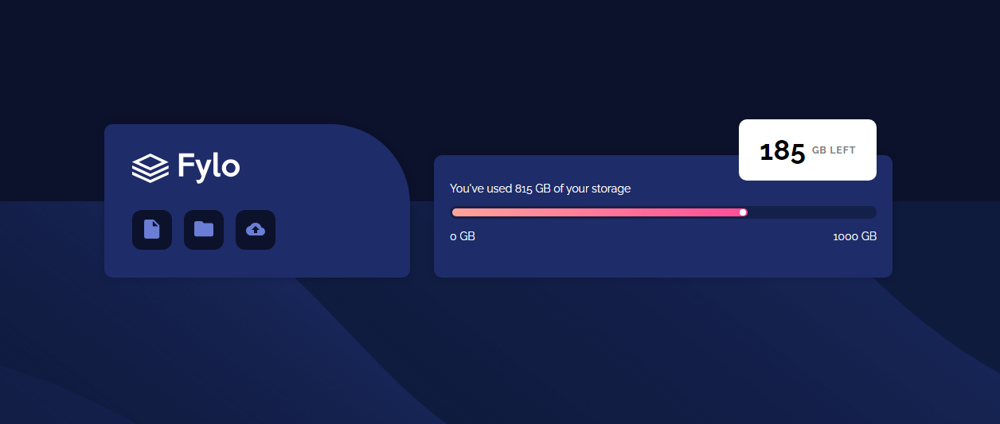

# Frontend Mentor - Fylo data storage component solution

This is a solution to the [Fylo data storage component challenge on Frontend Mentor](https://www.frontendmentor.io/challenges/fylo-data-storage-component-1dZPRbV5n). Frontend Mentor challenges help you improve your coding skills by building realistic projects. 

## Table of contents

- [Overview](#overview)
  - [The challenge](#the-challenge)
  - [Screenshot](#screenshot)
  - [Links](#links)
- [My process](#my-process)
  - [Built with](#built-with)
  - [What I learned](#what-i-learned)
  - [Useful resources](#useful-resources)
- [Author](#author)

## Overview

### The challenge

Users should be able to:

- View the optimal layout for the site depending on their device's screen size

### Screenshot



### Links

- Solution URL: [https://www.frontendmentor.io/solutions/create-a-layout-for-the-site-depending-on-their-devices-screen-YeDyvoXTV8](https://www.frontendmentor.io/solutions/create-a-layout-for-the-site-depending-on-their-devices-screen-YeDyvoXTV8)
- Live Site URL: [https://fylo-data-storage-component-ebon.vercel.app/](https://fylo-data-storage-component-ebon.vercel.app/)

## My process

### Built with

- Semantic HTML5 markup
- CSS custom properties
- Flexbox
- Mobile-first workflow

### What I learned
Setting an optimal layout for both desktop and mobile
```css
/*Mobile*/
@media screen and (max-width: 375px) {
  .bgImage {
    background: url(./images/bg-mobile.png);
  }
  .viewport {
    flex-direction: column;
  }
  .main-containers {
    display: flex;
    flex-direction: column;
    align-items: center;
    gap: 15px;
  }

  .storage-remaining {
    background-color: white;
    height: 70px;
    width: 40%;
    left: 50%;
    transform: translateX(-50%);
    display: flex;
    justify-content: center;
    align-items: center;
  }

}

/*Desktop*/
@media screen and (min-width: 376px) {
  .bgImage {
    background-color: #0c122c;
    background-image: url(./images/bg-desktop.png);
    background-repeat: no-repeat;
    background-position: bottom;
    background-size: 100% 50%;
  }
  .app-info-container {
    width: 20%;
  }
  .storage-info-container {
    width: 30%;
    position: relative;
  }
  .storage-remaining {
    width: 30%;
    height: 50%;
    position: absolute;
    right: 48px;
    top: -35px;
    margin: 0;
  }
  .storage-info {
    height: 100px;
    text-align: left;
  }
}
```
### Useful resources

- [Stack Overflow](https://stackoverflow.com/) - General CSS problem-solving.

## Author

- Frontend Mentor - [@Gathrik](https://www.frontendmentor.io/profile/Gathrik)

